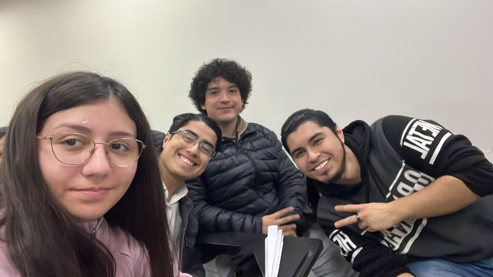

# [DESAFÍO 01| EDIFICIOS INTELIGENTES]

## Capstone Intermedio 2026
**Equipo:** [S.I.U HUB]  
**Desafío:** Caracterización de usuarios del Hub Providencia  
**Contraparte:** Municipalidad de Providencia / Hub Providencia  
**Estado actual:** En desarrollo

## Descripción
**Desafío Hub Providencia - Edificios Inteligentes**  
Solución tecnológica para registrar, caracterizar y analizar el flujo de usuarios en Hub Providencia. Incluye un sistema de registro, base de datos estructurada y un dashboard analítico para optimizar la gestión del espacio.

## Equipo
| Integrante | Carrera o especialidad | Rol inicial | Usuario de GitHub |
|---|---|---|---|
| [Tu Nombre] | [Tu Carrera] | [Tu Rol] | [@tu_usuario] |
| [Compañero 1] | [Carrera] | [Rol] | [Pendiente] |
| [Compañero 2] | [Carrera] | [Rol] | [Pendiente] |

## Valores del equipo
- Compromiso y responsabilidad
- Comunicación transparente
- Proactividad y trabajo en equipo

## Normas de funcionamiento
1. Asistir puntualmente a las reuniones y sesiones programadas.
2. Avisar con anticipación en caso de imprevistos o ausencias.
3. Actualizar la bitácora en GitHub al finalizar cada sesión.
4. **Desacuerdos:** Se resolverán mediante conversación, votación o mediación del equipo docente.
5. **Decisiones:** Toda decisión clave quedará registrada formalmente en la bitácora.

## Desafío inicial
¿Cómo podríamos cuantificar y caracterizar a los usuarios del edificio del Hub Providencia para apoyar la gestión y la toma de decisiones?

### Lo que sabemos
- El Hub Providencia recibe a emprendedores, startups, estudiantes, vecinos y visitantes.
- Existe información limitada sobre la frecuencia de uso, espacios ocupados y comportamiento de los visitantes.

### Lo que todavía no sabemos
- Cuántos usuarios nuevos vs. recurrentes visitan el edificio diariamente.
- Cuál es el flujo exacto en los distintos espacios y horarios de mayor demanda.

### Supuestos que debemos comprobar
- Es posible implementar un enrolamiento inicial rápido que no genere molestia en los usuarios.
- La recopilación de datos permitirá al equipo de gestión optimizar los servicios ofrecidos.

## Objetivo SMART del equipo
[Escriban un objetivo específico, medible, alcanzable, relevante y con fecha límite]

## Compromisos individuales
| Integrante | Compromiso SMART |
|---|---|
| [Tu Nombre] | [Tu compromiso personal en el proyecto] |

## Usuarios y contexto
Emprendedores, startups, estudiantes, vecinos y visitantes del Hub Providencia, junto con el equipo de gestión del edificio.

## Plan inicial
| Actividad | Responsable(s) | Fecha | Estado |
|---|---|---|---|
| Crear repositorio y estructurar README inicial | [Tu Nombre] | [Fecha hoy] | Completado |
| Definición de identidad del equipo y roles | [Equipo] | [Fecha] | En proceso |
| Levantamiento de información e investigación del flujo | [Equipo] | [Fecha] | Pendiente |

## Índice de la bitácora
- [S01 - Identidad del equipo y desafío](bitacora/S01.md)

## Evidencias principales
- [Foto del equipo](foto_grupal.jpeg)

## Decisiones relevantes
| Fecha | Decisión | Evidencia o criterio utilizado |
|---|---|---|
| [Fecha hoy] | Creación de la estructura base en GitHub | Organización de la bitácora del proyecto Capstone |

## Próximo hito
Completar la primera sesión de la bitácora (`bitacora/S01.md`) y realizar el levantamiento inicial de información con el Hub Providencia.

## Uso y licencia
Por definir con el equipo docente y la contraparte.
