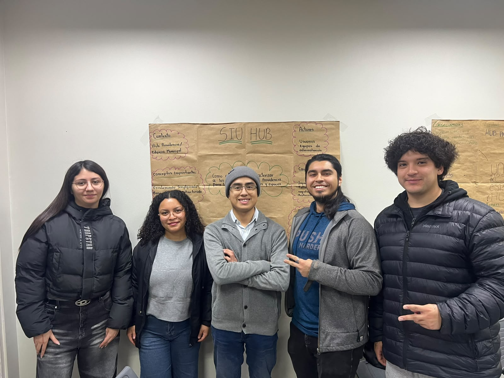

# Desafío 01 | Edificios Inteligentes

## Capstone Intermedio 2026
**Equipo:** S.I.U HUB  
**Desafío:** Caracterización de usuarios del Hub Providencia  
**Contraparte:** Municipalidad de Providencia / Hub Providencia  
**Estado actual:** En desarrollo

## Descripción
**Desafío Hub Providencia - Edificios Inteligentes**  
Solución tecnológica para registrar, caracterizar y analizar el flujo de usuarios en Hub Providencia. Incluye un sistema de registro, base de datos estructurada y un dashboard analítico para optimizar la gestión del espacio.

## Equipo
| Integrante | Carrera o especialidad | Rol  | Usuario de GitHub |
|---|---|---|---|
| Amanda Parraguez | Ing. Civil Industrial | Lider de proyecto  | [@amandaparraguez-blip](https://github.com/amandaparraguez-blip) |
| Benjamín Oliva | Ing. Civil en computación e Informática | Desarrollo web y dashboard | [@bnj-92](https://github.com/bnj-92) |
| Gerzon Toro | Ing. Civil en computación e Informática | Coordinación técnica y backend | [@gerzontoro](https://github.com/gerzontoro) |
| Josué Villa | Ing. Civil Electrónica | Desarrollo e integración | [@jvilla-02](https://github.com/jvilla-02) |
| Valentina Zapata | Ing. Civil Industrial | Diseño y experiencia de usuario | [@valentinazapatat-beep](https://github.com/valentinazapatat-beep) |

## Valores del equipo
- Compromiso y responsabilidad
- Comunicación transparente
- Proactividad y trabajo en equipo

## Normas de funcionamiento
1. Asistir puntualmente a las reuniones y sesiones programadas.
2. Avisar con anticipación en caso de imprevistos o ausencias.
3. Actualizar la bitácora en GitHub al finalizar cada sesión.
4. **Desacuerdos:** Se resolverán mediante conversación, votación o mediación del equipo docente.
5. **Decisiones:** Toda decisión clave quedará registrada formalmente en la bitácora.

## Desafío inicial
¿Cómo podríamos cuantificar y caracterizar a los usuarios del edificio del Hub Providencia para apoyar la gestión y la toma de decisiones?

### Lo que sabemos
- El Hub Providencia recibe a emprendedores, startups, estudiantes, vecinos y visitantes.
- Existe información limitada sobre la frecuencia de uso, espacios ocupados y comportamiento de los visitantes.
- El registro de ingreso se realiza mediante un formulario de Google que solicita
  nueve campos y debe completarse en cada visita.
- El formulario no permite reconocer a una persona que ya visitó el edificio ni
  registra su salida.
- Las áreas especiales se autorizan por correo, la sala de reuniones se agenda en
  recepción y las charlas usan un registro aparte.

### Lo que todavía no sabemos
- Cuántos usuarios nuevos vs. recurrentes visitan el edificio diariamente.
- Cuál es el flujo exacto en los distintos espacios y horarios de mayor demanda.
- Qué se hace actualmente con los datos recolectados por el formulario.
- Cuál es el tiempo de permanencia de las personas en el edificio.

### Supuestos que debemos comprobar
- Es posible implementar un enrolamiento inicial rápido que no genere molestia en los usuarios.
- La recopilación de datos permitirá al equipo de gestión optimizar los servicios ofrecidos.
- Las personas escanearán su credencial también al salir, y no solo al ingresar.
- Los indicadores generados serán efectivamente utilizados por el equipo de gestión
  para tomar decisiones.

## Compromisos individuales
| Integrante | Compromiso SMART |
|---|---|
| Amanda Parraguez | Me comprometo a llegar antes de la hora de inicio a las clases y reuniones del equipo durante todo el semestre, avisando el mismo día cuando no pueda, y a cumplir dentro del plazo las tareas que asuma. También me comprometo a reforzar mis conocimientos técnicos para aportar en el desarrollo del prototipo, y no solo en la documentación. |
| Gerzon Toro | Como Desarrollador Backend y Gestor de Base de Datos en el proyecto, me comprometo a diseñar e implementar una arquitectura de base de datos relacional y una API REST eficiente utilizando exclusivamente tecnologías open-source o de costo cero, garantizando la seguridad de la información y tiempos de respuesta inferiores a 200 ms. Seré responsable de conectar el prototipo físico de registro con la base de datos y de desarrollar un sistema de enrolamiento simplificado que automatice la identificación de usuarios recurrentes, entregando el esquema de datos, los endpoints integrados y la optimización final del sistema documentado dentro de los plazos establecidos para los hitos del proyecto. |
| Benjamín Oliva |Me comprometo a asistir puntualmente a las clases, entregar cada actividad y avance del proyecto dentro del plazo fijado y aportar activamente en el trabajo semanal hasta finalizar el semestre.  |
| Josué Villa | Me comprometo a investigar, evaluar y definir la arquitectura de hardware/tecnología de captura de datos (sensores, lectores de identificación o dispositivos de registro) para el prototipo del Hub Providencia, entregando un informe técnico comparativo de al menos 2 alternativas tecnológicas viables y de bajo costo antes de finalizar la semana 3 del proyecto. |
| Valentina Zapata | _Pendiente de definir_ |

## Usuarios y contexto
Emprendedores, startups, estudiantes, vecinos y visitantes del Hub Providencia, junto con el equipo de gestión del edificio.

## Plan inicial

| Actividad | Responsable(s) | Fecha | Estado |
|---|---|---|---|
| Definición de identidad del equipo y roles | Equipo | 24-08-2026 | Completado |
| Elaboración del mapa conceptual del desafío | Equipo | 25-08-2026 | Completado |
| Visita a terreno y levantamiento del proceso actual | Amanda, Gerzon | 25-08-2026 | Completado |
| Delimitación del alcance respecto de los desafíos 02 y 03 | Equipo | 26-08-2026 | Completado |
| Elaboración de la ficha del desafío | Equipo | | En proceso |
| Preparación del pitch del tema | Equipo | | En proceso |
| Validación del alcance y definiciones técnicas con el equipo | Equipo | | Pendiente |

## Índice de la bitácora
- [S01 — Semana del 25 de agosto al 1 de septiembre de 2026](bitacora/S01.md)
- [S02 — Semana del 1 al 8 de septiembre de 2026](bitacora/S02.md)

## Evidencias principales
- [Evidencias](bitacora/evidencias/)
- [Contrato del equipo](contrato-equipo.docx)

## Decisiones relevantes
| Fecha | Decisión | Criterio o justificación |
|---|---|---|
| 21-08-2026 | Creación de la estructura base en GitHub | Organización de la bitácora del proyecto Capstone |
| 25-08-2026 | Realizar visita presencial al Hub Providencia | La información pública disponible no detallaba las áreas ni el funcionamiento del edificio |
| 25-08-2026 | Centrar el pitch en el problema y no en la solución | Indicación de la profesora en clase |
| 26-08-2026 | Dejar fuera del alcance el módulo de reservas de espacios | Corresponde al Desafío 02, que aborda la reserva de salas, cowork y laboratorios |
| 26-08-2026 | Dejar fuera del alcance la medición de ocupación en tiempo real mediante sensores | Corresponde al Desafío 03, que mide ocupación y disponibilidad del cowork |
| 26-08-2026 | Mantener en el alcance el registro del área declarada al ingresar | La ficha del Desafío 01 solicita identificar qué espacios ocupan los usuarios, y el formulario actual ya captura ese dato |

## Próximo hito
*Actualizado al 1 de septiembre de 2026*
Presentar el pitch del desafío y entregar la ficha del caso con la información
levantada en terreno.

## Uso y licencia
Por definir con el equipo docente y la contraparte.
