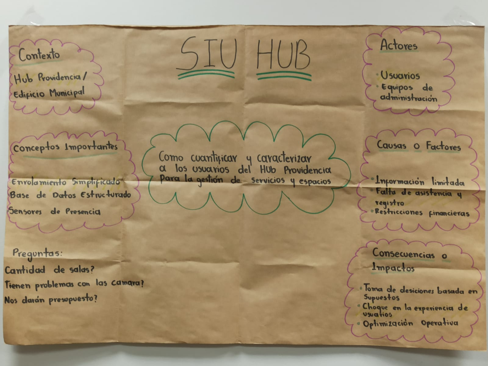
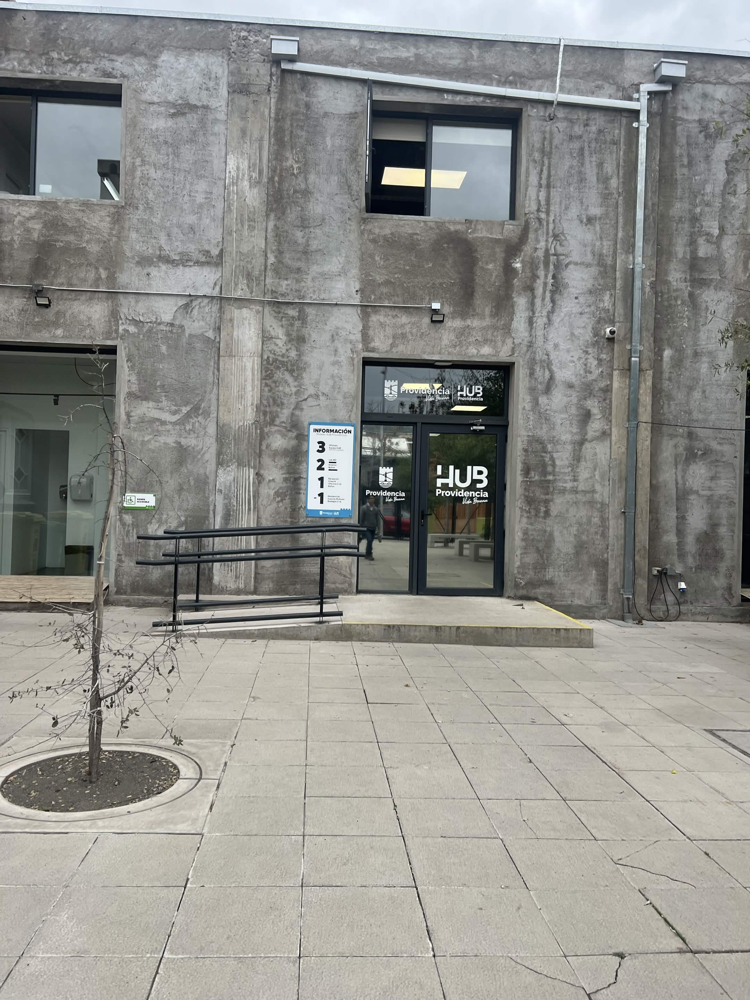
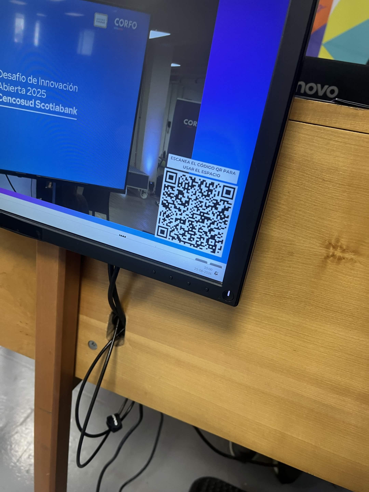
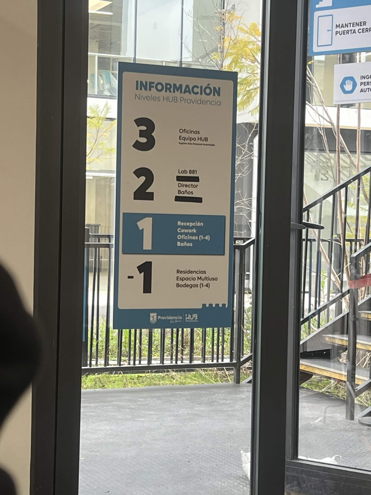
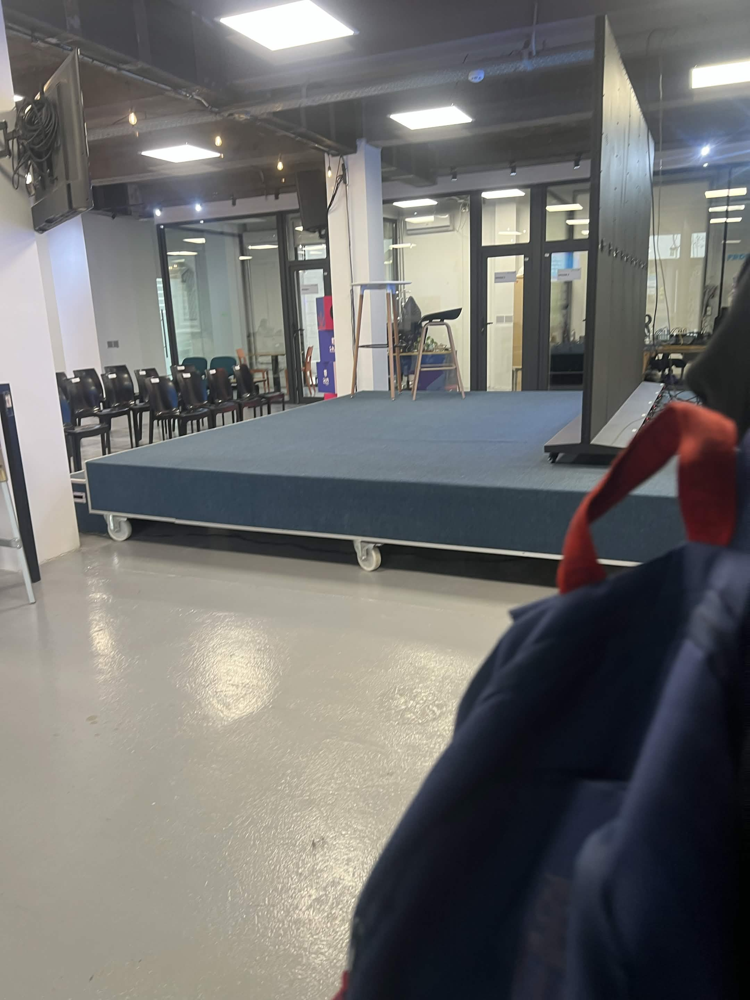

# S01 — Semana del 25 de agosto al 1 de septiembre de 2026

## 📅 Fecha
25 de agosto de 2026

## 🏫 Trabajo realizado en clase

### 📝 Actividades
Durante esta sesión, el equipo trabajó en la conformación del grupo y en
la definición inicial del desafío asociado a Hub Providencia.

Se revisaron los objetivos generales del proyecto y se comenzó a
delimitar la problemática relacionada con la caracterización de los
usuarios del edificio.

Como ejercicio en clase, el equipo construyó un mapa conceptual del desafío en papelógrafo, 
ubicando al centro la pregunta orientadora e incorporando a su alrededor el contexto, los actores, 
las causas, las consecuencias, los conceptos clave y las preguntas abiertas.

### 📋 Papelógrafo
Mapa conceptual del desafío elaborado por el equipo.

Pregunta central: Cómo cuantificar y caracterizar a los usuarios del Hub Providencia para la gestión de servicios y espacios.
| Elemento | Contenido |
|---|---|
| **Contexto** | Hub Providencia / Edificio Municipal |
| **Actores** | Usuarios del edificio (emprendedores, startups, estudiantes, empresas, vecinos y visitantes) y equipo de administración del Hub |
| **Causas o factores** | Información limitada; falta de asistencia y registro; restricciones financieras |
| **Consecuencias o impactos** | Toma de decisiones basada en supuestos; dificultades en la experiencia de los usuarios; pérdida de oportunidades de optimización operativa |
| **Conceptos importantes** | Enrolamiento simplificado; base de datos estructurada; sensores de presencia |
| **Preguntas abiertas** | Cantidad de salas disponibles; existencia de cámaras y su situación actual; disponibilidad de presupuesto |

**Relaciones identificadas entre los elementos:**

- La información limitada y la falta de registro provocan que la gestión del Hub tome decisiones basadas en supuestos.
- Sin registro estructurado no es posible caracterizar a los distintos actores ni diferenciar sus patrones de uso.
- Las restricciones financieras condicionan las tecnologías viables, lo que refuerza la necesidad de herramientas sin costo de licencias.
- El enrolamiento simplificado ataca directamente la causa "falta de asistencia y registro", ya que reduce la fricción del ingreso.

### 💬 Preguntas y discusión
Se discutió cómo cuantificar a los usuarios sin generar fricción en el ingreso, y si el sistema debía contemplar también el registro de salidas.

Quedaron planteadas las siguientes preguntas, que motivaron la visita presencial al Hub:

- ¿Cuántas salas hay disponibles y de qué tipo?
- ¿Existen cámaras instaladas y cuál es su situación actual?
- ¿Habrá presupuesto disponible para implementar hardware?
- ¿Cuál es el proceso de registro que utilizan actualmente?

### 👥 Roles y organización
| Integrante | Carrera | Rol | Responsabilidad |
|---|---|---|---|
| Amanda | Ing. Civil Industrial | Líder de proyecto y procesos | ... |
| Benjamín | Ing. Civil en Computación e Informática | Frontend y Dashboard | ... |
| Gerzon | Ing. Civil en Computación e Informática | Backend y Base de Datos | ... |
| Josué | Ing. Civil Electrónica | Hardware e Integración | ... |
| Valentina | Ing. Civil Industrial | Métricas y Pilotaje | ... |

Durante esta semana se incorporó Valentina al equipo, quedando conformado por 5 integrantes.

### 🎤 Organización del Pitch

Se comenzó a definir la estructura del pitch y la participación de los integrantes.

Considerando la indicación de la profesora de que el pitch debe abordar el tema y no la solución, se acordó que la presentación se centrará en:

- Problema identificado.
- Usuarios afectados.
- Evidencia del problema, a partir de la información levantada en terreno.
- Contexto actual de operación del Hub.

### 🧠 Aprendizajes

Durante esta actividad, el equipo comprendió la importancia de definir correctamente el problema antes de comenzar el desarrollo de una solución tecnológica.

También se identificó la necesidad de respaldar las decisiones del proyecto mediante información obtenida directamente del contexto del Hub Providencia, lo que se confirmó al constatar que la información pública disponible era insuficiente.

## 🏠 Trabajo realizado fuera de clases
🏢 Visita a terreno — Hub Providencia

El mismo 25 de agosto, a las 15:10 horas, Amanda y Gerzon realizaron una visita presencial al Hub Providencia para levantar información directa sobre el funcionamiento del edificio. El resto del equipo no pudo asistir por tener clases en ese horario.

Hallazgos del levantamiento:

- Ingreso: al llegar se solicita escanear un código QR que dirige a un formulario de Google, donde la persona ingresa sus datos y el área a la que se dirige. El primer piso es de acceso libre y gratuito para todo público.
- Reservas: existe una sola sala de reuniones, con capacidad para 1 a 4 personas, que se agenda directamente en recepción. El procedimiento de reserva e ingreso a esas zonas resultó ambiguo y no está documentado.
- Áreas especiales: el Lab, la Zona Gamer y el área Textil requieren enviar un correo previo para solicitar autorización de uso.
- Charlas y actividades: se utiliza un código QR único para tomar la asistencia de los participantes.
- Oficinas de startups: están destinadas a los emprendimientos que obtuvieron el espacio mediante postulación.
- Infraestructura: solo uno de los edificios está abierto al público; el otro es de uso exclusivamente administrativo.

### Implicancias para el proyecto:
El formulario de Google obliga a la persona a reingresar todos sus datos en cada visita, lo que confirma el requerimiento de la ficha del desafío de contar con un enrolamiento inicial y registros posteriores simplificados. Además, no permite registrar salidas ni analizar patrones de uso, por lo que la información queda sin ser aprovechada para la gestión.

### Otras actividades
- Revisión de los antecedentes disponibles sobre Hub Providencia.
- Organización del repositorio de GitHub.
- Distribución de responsabilidades entre los integrantes.
- Revisión de posibles tecnologías para el sistema.

### Acuerdos
- Realizar una visita presencial al Hub para levantar información directa, dado que la página web no detalla las áreas ni su funcionamiento.
- Priorizar herramientas y software sin costo de licencias, según lo indicado en la ficha del desafío.
- Centrar el pitch en el problema y no en la solución, siguiendo la indicación de la profesora.
- Registrar en la bitácora del repositorio las dudas dirigidas a la contraparte.

## 📌 Avances obtenidos
Como resultado de esta sesión, el equipo logró:

- Definir la composición y roles iniciales.
- Formular el desafío inicial y representarlo en un mapa conceptual.
- Identificar a los principales usuarios y actores involucrados.
- Establecer los primeros supuestos que deberán ser validados.
- Levantar en terreno el flujo actual de ingreso y uso de espacios del Hub.
- Organizar la estructura inicial del repositorio.

## ⚠️ Problemas o dificultades
- La información pública disponible sobre el Hub es limitada y no detalla las áreas ni el funcionamiento del edificio, por lo que el equipo trabajó inicialmente sobre supuestos que debieron validarse en terreno.
- Solo dos integrantes pudieron asistir a la visita presencial, ya que el resto tenía clases en ese horario. Se acordó compartir los hallazgos con todo el equipo.
- El procedimiento de reserva de espacios y de autorización de áreas especiales resultó ambiguo y no se encuentra documentado.

## 📌 Tareas pendientes

- [x] Completar la columna de responsabilidades de cada integrante
- [x] Elaborar la ficha de desafío con la información propia levantada en terreno
- [ ] Definir la estructura final del pitch, centrado en el problema
- [ ] Consultar por la situación actual de las cámaras del edificio
- [ ] Consultar qué se hace actualmente con los datos recolectados por el formulario de Google

## 📷 Evidencias

### Mapa conceptual del desafío

### Visita a terreno — Hub Providencia (25-08-2026)

**Entrada del edificio**

**Código QR de registro de ingreso**

**Información disponible en el Hub**

**Espacio de charlas y sala de reuniones**

