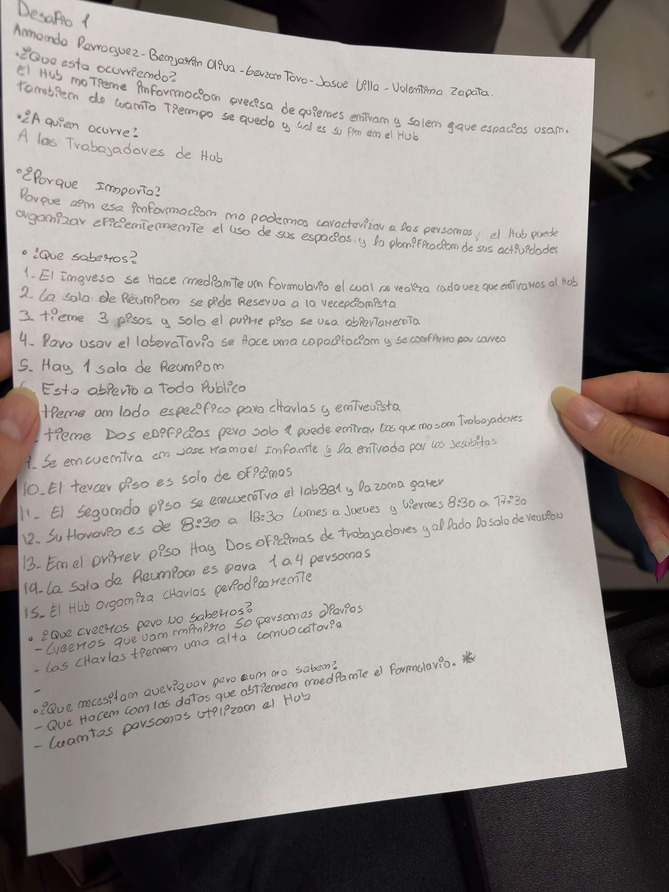

# S02 — Semana del 1 al 8 de septiembre de 2026

## 📅 Fecha
1 de septiembre de 2026

## 🏫 Trabajo realizado en clase

### 📝 Actividades
Durante esta sesión el equipo presentó el pitch del tema, centrado en el
problema y no en la solución, según lo indicado la semana anterior. La
presentación se desarrolló sin inconvenientes y la profesora valoró
especialmente que el equipo hubiera visitado el Hub Providencia de forma
presencial para levantar información directa.

Con esto se cumplieron los tres entregables solicitados por la profesora para
el 1 de septiembre: pitch del tema, ficha del desafío (máximo dos carillas)
y bitácora al día con el trabajo en clase y fuera de clase.

Con esta sesión se cerró la Unidad 1, orientada a la comprensión del
problema, y se dio inicio a la etapa de exploración de soluciones.

Además, la profesora entregó una pauta de siete puntos que cada equipo
debe considerar en sus presentaciones orales:

1. Tema o ámbito del desafío.
2. Contexto: dónde ocurre, en qué organización o territorio.
3. Quiénes están involucrados o afectados.
4. Situación problemática inicial.
5. Por qué es relevante.
6. Qué saben hasta ahora (2 o 3 antecedentes o evidencias).
7. Qué todavía no saben.

### 📋 Ejercicio en clase — respuestas del equipo
A partir de esa pauta, el equipo respondió en clase las siguientes
preguntas sobre el desafío. Se transcribe la hoja de trabajo:

**¿Qué está ocurriendo?**
El Hub no tiene información precisa de quiénes entran y salen ni de qué
espacios usan. Tampoco de cuánto tiempo se quedan ni cuál es su fin en el Hub.

**¿A quién le ocurre?**
A los trabajadores del Hub.

**¿Por qué importa?**
Porque sin esa información no es posible caracterizar a las personas, y con
ella el Hub puede organizar de forma eficiente el uso de sus espacios y la
planificación de sus actividades.

**¿Qué sabemos?**
1. El ingreso se hace mediante un formulario que debe completarse cada vez
   que se entra al Hub.
2. La sala de reunión se reserva directamente con la recepcionista.
3. El edificio tiene 3 pisos y solo el primero se usa abiertamente.
4. Para usar el laboratorio se realiza una capacitación y se confirma por correo.
5. Hay una sola sala de reunión.
6. Está abierto a todo público.
7. Tiene un sector específico para charlas y entrevistas.
8. Tiene dos edificios, pero solo a uno pueden entrar quienes no son trabajadores.
9. Se encuentra en José Manuel Infante y la entrada es por Los Jesuitas.
10. El tercer piso es solo de oficinas.
11. En el segundo piso se encuentran el laboratorio y la zona gamer.
12. Su horario es de 8:30 a 18:30 de lunes a jueves, y viernes de 8:30 a 17:30.
13. En el primer piso hay dos oficinas de trabajadores y, al lado, la sala de reunión.
14. La sala de reunión es para 1 a 4 personas.
15. El Hub organiza charlas periódicamente.

**¿Qué creemos pero no sabemos?**
- Creemos que van como mínimo 50 personas diarias.
- Las charlas tienen una alta convocatoria.

**¿Qué necesitamos averiguar?**
- Qué hacen con los datos que obtienen mediante el formulario. **(*)**
- Cuántas personas utilizan el Hub.

> (*) Pregunta marcada por el equipo como indispensable de resolver con la
> contraparte, ya que condiciona el diseño de la base de datos y de los
> indicadores del dashboard.

### 💬 Preguntas y discusión
Se consultó a la profesora por la delimitación de alcance definida en la S01
respecto de los desafíos 02 y 03, dado que el equipo había dejado fuera el
módulo de reservas y la medición de ocupación para no superponerse con otros
equipos. La indicación fue que el equipo no debe preocuparse de los demás
desafíos, sino concentrarse únicamente en el propio y en lo que solicita su
ficha.

Con esto, el criterio para decidir qué entra o no en el alcance deja de ser
la posible superposición con otros equipos y pasa a ser exclusivamente lo que
pide la ficha del Desafío 01: registro de ingresos (y salidas cuando sea
viable), base de datos estructurada y dashboard de indicadores.

### 🧠 Aprendizajes
- Levantar información en terreno fue lo que le dio peso al pitch: la evidencia
  propia se valora más que los antecedentes públicos disponibles.
- Delimitar el alcance "por descarte" respecto de otros equipos era un criterio
  equivocado. El alcance se define a partir de lo que pide el propio desafío.
- La pauta de siete puntos sirve como estructura base para todas las
  presentaciones futuras, no solo para el pitch.

### 📢 Indicaciones de la profesora para la semana
- Se cierra la Unidad 1 (comprensión del problema) y comienza la etapa de
  exploración de soluciones.
- Cada equipo debe enfocarse en su propio desafío y en lo que indica su ficha,
  sin condicionar el alcance por lo que hagan otros equipos.
- Las presentaciones orales deben cubrir los siete puntos de la pauta entregada.

## 🏠 Trabajo realizado fuera de clases

### 👥 Reunión de equipo — 7 de septiembre
La reunión semanal de los lunes no se realizó esta semana. Los temas que
quedaron pendientes de tratar se abordarán en la clase del 8 de septiembre
o en la reunión del lunes 14:

- Revisar la ficha del Desafío 01 y redefinir el alcance según la indicación
  de la profesora.
- Retomar las definiciones técnicas que quedaron en evaluación en la S01
  (aplicación web, registro diferenciado por tipo de usuario, registro de
  salida, registro para charlas).
- Definir cómo y cuándo se hará llegar a la contraparte la pregunta marcada
  con asterisco.

### Otras actividades
- Transcripción de la hoja de trabajo del 1 de septiembre y actualización de
  la bitácora en el repositorio.

### Acuerdos
- Redefinir el alcance del proyecto tomando como único criterio la ficha del
  Desafío 01, dejando sin efecto la exclusión por superposición con los
  desafíos 02 y 03.
- Registrar en la bitácora la pregunta indispensable para la contraparte
  (qué se hace con los datos del formulario), para dejar constancia ante el
  equipo docente.
- Mantener las reuniones de equipo los días lunes.

## 📌 Avances obtenidos
- Presentación del pitch del tema, con buena recepción.
- Entrega de la ficha del desafío y bitácora al día, según lo solicitado.
- Cierre de la Unidad 1 y paso a la etapa de exploración de soluciones.
- Sistematización del conocimiento del equipo sobre el Hub en un listado de
  15 hechos verificados, 2 supuestos y 2 preguntas por resolver.
- Aclaración del criterio de alcance con la profesora.

## ⚠️ Problemas o dificultades
- La delimitación de alcance hecha en la S01 debe revisarse, ya que se basó en
  un criterio (evitar superposición con otros desafíos) que la profesora indicó
  no considerar.
- Sigue pendiente la pregunta a la contraparte sobre qué se hace con los datos
  del formulario, que condiciona el diseño de la base de datos y del dashboard.
- No se tiene una cifra real de cuántas personas usan el Hub; el equipo trabaja
  con la estimación de al menos 50 personas diarias, que debe validarse.
- No se realizó la reunión de equipo de esta semana, por lo que las
  definiciones de alcance y técnicas quedaron postergadas para la próxima
  sesión.

## 📌 Tareas pendientes

Arrastradas desde S01:
- [ ] Consultar por la situación actual de las cámaras del edificio
- [ ] Consultar qué se hace actualmente con los datos recolectados por el formulario de Google **(*)**
- [ ] Definir el listado simplificado de profesiones para el enrolamiento
- [ ] Evaluar alternativas para el registro de salida

Nuevas:
- [ ] Redefinir el alcance del proyecto según la ficha del Desafío 01
- [ ] Validar la estimación de personas diarias que usan el Hub
- [ ] Definir cómo se contactará a la contraparte para resolver las preguntas pendientes
- [ ] Comenzar a levantar alternativas de solución para el registro de ingreso

## 📷 Evidencias

### Hoja de trabajo en clase — 1 de septiembre

