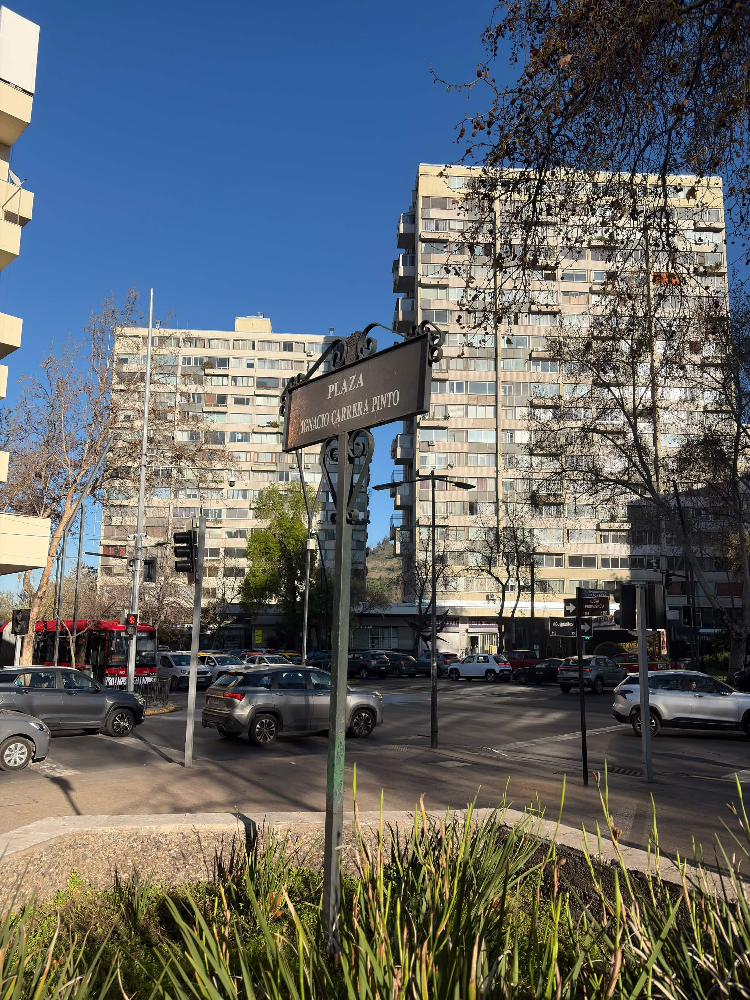
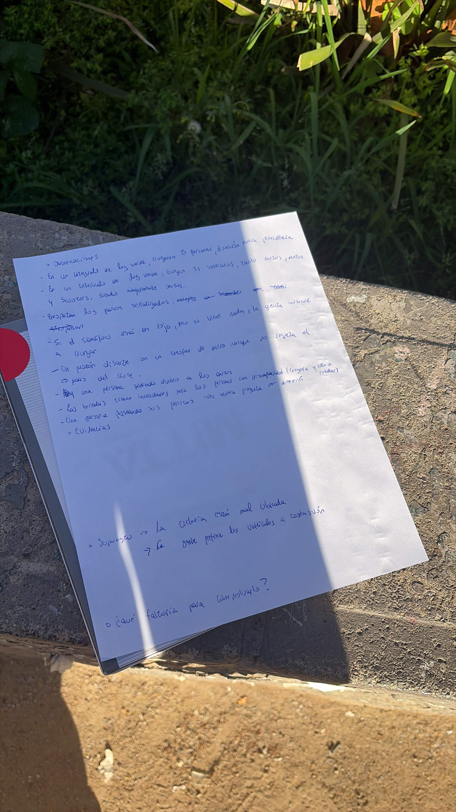

# S03 — Semana del 8 al 15 de septiembre de 2026

## 📅 Fecha
8 de septiembre de 2026

## 🏫 Trabajo realizado en clase

### 📝 Actividades

#### Ejercicio de observación — salir de la sala
La profesora propuso un ejercicio de observación en terreno: cada equipo
debía salir a una esquina cercana al campus y observarla durante 10 minutos,
con cada integrante mirando desde una perspectiva distinta (flujos y uso del
espacio; conductas e interacciones; espacio e infraestructura; información,
objetos y tecnología; accesibilidad y dificultades de uso). No se podía
entrevistar ni interactuar con las personas, solo observar y sacar una foto
al final.

El equipo observó la esquina de la Plaza Ignacio Carrera Pinto (Nueva
Providencia con Miguel Claro).

**Observaciones individuales registradas (Benjamín):**
- En un intervalo de luz verde cruzaron 21 personas en dirección a Nueva Providencia.
- En un intervalo de luz verde cruzaron 31 vehículos (autos, motos y scooters), mayormente autos.
- Se respetan los pasos señalizados.
- Si el semáforo está en rojo pero no viene nadie, la gente tiende a cruzar igual.
- Un peatón discutió con un chofer de micro porque no respetó el paso del cruce.
- Una persona pidiendo dinero a los autos.
- Las veredas tienen facilidades para personas con discapacidad (ceguera y silla de ruedas).
- Una persona paseando a sus perros; una señora preguntando por una dirección.
- Supuestos surgidos: la ciclovía está mal ubicada; la gente prefiere los vehículos a combustión.

**Síntesis del equipo (hoja de trabajo):**

| Ítem | Respuesta del equipo |
|---|---|
| Comportamiento inesperado | Un transeúnte discutió con un chofer de micro por detenerse sobre el paso peatonal. Casi atropellan a una persona que iba en scooter. |
| Lo que contradijo lo esperado | Esperábamos que muchas personas cruzaran con el semáforo en rojo y solo lo hicieron unas pocas. Esperábamos que no transitaran tantos scooters, pero hay varias personas que los usan. |
| 5 hechos respaldados por observación | La mayoría de las personas van solas. La mayoría va con mochila, bolsos y carteras. Transitan muchos autos. Hay una cantidad regular de personas en la esquina. Hubo ocasiones en que casi ocurre un accidente. Las calles están dañadas. |
| 3 interpretaciones o supuestos | Falta cultura vial. Mucha dependencia a tener vehículo. Las personas van apuradas. |
| 2 patrones de uso del espacio | Las personas esperan en la esquina para cruzar. Las bicicletas usan el espacio de peatones en vez de la ciclovía. |
| 1 situación que contradijo lo esperado | Casi atropellan a una persona en scooter. |
| 2 preguntas que la observación no responde | ¿Por qué la gente camina rápido? ¿Por qué la bicicleta no usa la ciclovía al cruzar? |

#### Conexión con el proyecto Capstone
Aplicando la misma lógica del ejercicio (distinguir hecho, interpretación y
supuesto), el equipo revisó tres afirmaciones que venía tratando como hechos:

| Afirmación | ¿Hecho, interpretación o supuesto? | Evidencia actual | Evidencia que falta |
|---|---|---|---|
| No tienen un sistema de registro con enrolamiento único | Hecho | Registro mediante QR a un Google Forms | Datos obtenidos del formulario |
| No registran la salida | Hecho | La gente se retira sin más | Observar en el Hub cómo se van las personas |
| Al Hub van personas de distintas situaciones laborales | Supuesto | Información que el Hub entrega en su página web | Ir al Hub varias veces y datos del formulario |

#### Lluvia de ideas de solución
Con la Unidad 1 cerrada, el equipo hizo su primera lluvia de ideas en
papelógrafo. Al centro se ubicó el problema, definido como **falta de
visibilidad y centralización de datos**, y alrededor las ideas:

- QR con enrolamiento único
- Una aplicación del Hub
- Entrada y salida con carnet
- Tarjeta de ingreso especial para el Hub
- Sensores infrarrojos
- Cámaras con IA
- Torniquetes con reconocimiento facial
- Reservas en página web

Ninguna idea fue descartada en esta etapa; se evaluarán considerando la
restricción de que el proyecto no cuenta con financiamiento para hardware ni
licencias.

### 💬 Preguntas y discusión
- Se discutió el orden de prioridad del trabajo: el equipo se enfocará
  primero en el sistema de registro (enrolamiento, ingreso y salida), que es
  el núcleo de la ficha, y solo si alcanza el tiempo se agregaría la reserva
  de la sala de reuniones.
- Varias ideas de la lluvia (torniquetes, cámaras con IA, sensores) requieren
  hardware, lo que choca con la restricción de costo cero. Quedan registradas
  pero con baja viabilidad.

### 🧠 Aprendizajes
- Observar sin interactuar obliga a separar lo que uno ve de lo que uno
  interpreta. Varias cosas que "sabíamos" del Hub resultaron ser supuestos
  sin evidencia.
- Lo que esperábamos encontrar en la esquina no coincidió con lo observado,
  lo que refuerza la necesidad de volver al Hub a observar en vez de asumir.
- Antes de diseñar la solución conviene conseguir los datos del formulario
  actual: dos de las tres afirmaciones del proyecto dependen de eso.

### 📢 Indicaciones de la profesora para la semana
- Completar los hallazgos del ejercicio de observación como equipo y subir
  el registro de la actividad a la bitácora.

## 🏠 Trabajo realizado fuera de clases

### Otras actividades
- Recopilación de las fotos y notas individuales del ejercicio de observación.
  Solo Benjamín envió su vista; las de Gerzon, Josué y Valentina quedan pendientes.
- Actualización de la bitácora en el repositorio.

### Acuerdos
- Priorizar el sistema de registro como núcleo del proyecto. La reserva de la
  sala de reuniones queda como funcionalidad opcional, solo si el avance lo permite.
- Las ideas de solución que dependen de hardware se mantienen registradas pero
  no se desarrollarán mientras no exista financiamiento.
- Volver al Hub a observar antes de definir la solución, para transformar los
  supuestos en hechos.

## 📌 Avances obtenidos
- Ejercicio de observación completado y sintetizado como equipo.
- Revisión crítica de las afirmaciones del proyecto: dos hechos confirmados y
  un supuesto identificado.
- Primera lluvia de ideas de solución (8 ideas).
- Definición de la prioridad de desarrollo: registro primero, reservas después.

## ⚠️ Problemas o dificultades
- Faltan las observaciones y fotos individuales de tres integrantes, por lo
  que la síntesis del ejercicio se armó con las vistas de Amanda y Benjamín
  más lo trabajado en la hoja grupal.
- Sigue sin resolverse la pregunta a la contraparte sobre qué se hace con los
  datos del formulario, que ahora también aparece como evidencia faltante en
  dos de las tres afirmaciones del proyecto.

## 📌 Tareas pendientes

Arrastradas:
- [ ] Consultar por la situación actual de las cámaras del edificio
- [ ] Consultar qué se hace actualmente con los datos recolectados por el formulario de Google **(*)**
- [ ] Definir el listado simplificado de profesiones para el enrolamiento
- [ ] Evaluar alternativas para el registro de salida
- [ ] Validar la estimación de personas diarias que usan el Hub

Nuevas:
- [ ] Recopilar las observaciones de Gerzon, Josué y Valentina del ejercicio de la esquina
- [ ] Planificar una segunda visita al Hub para observar el ingreso y la salida de personas
- [ ] Evaluar las ideas de solución según viabilidad y costo, y seleccionar las que se desarrollarán
- [ ] Definir qué información captura el enrolamiento único

## 📷 Evidencias
## 📷 Evidencias

### Ejercicio de observación — 8 de septiembre
**Foto del equipo en la esquina**

**Vista de Amanda**

**Vista de Benjamín**

**Notas de observación de Benjamín**

**Hoja de trabajo grupal**

### Lluvia de ideas de solución

