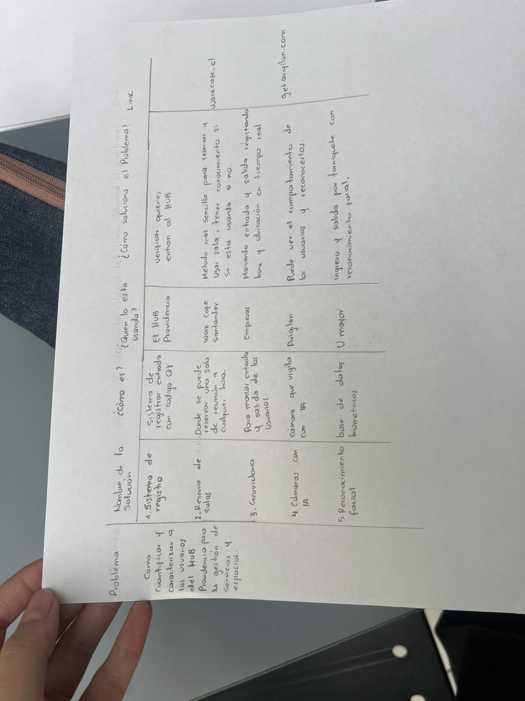
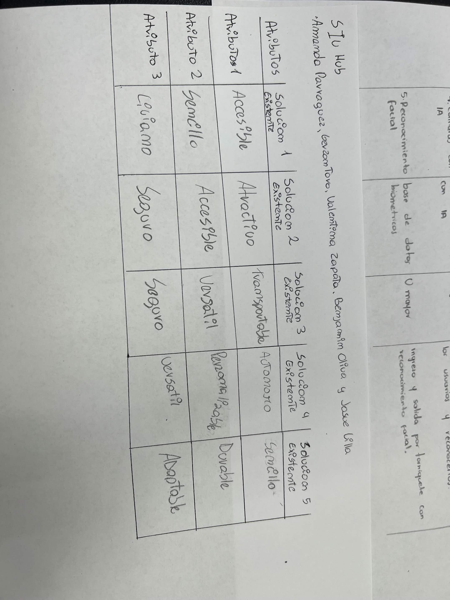
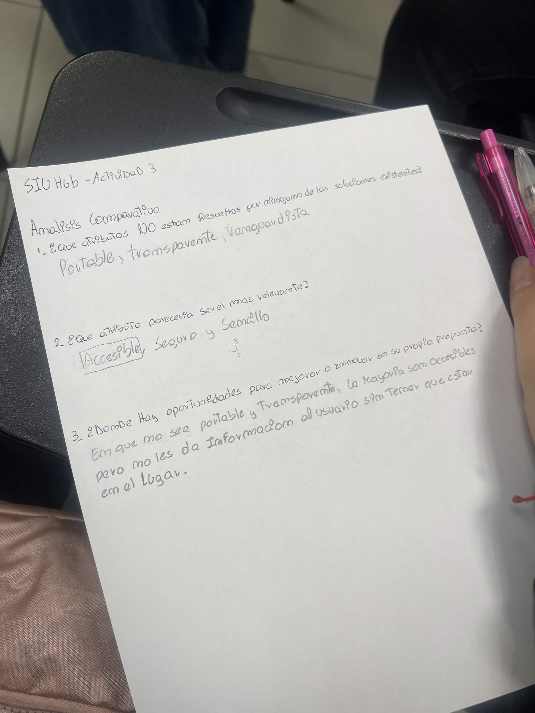
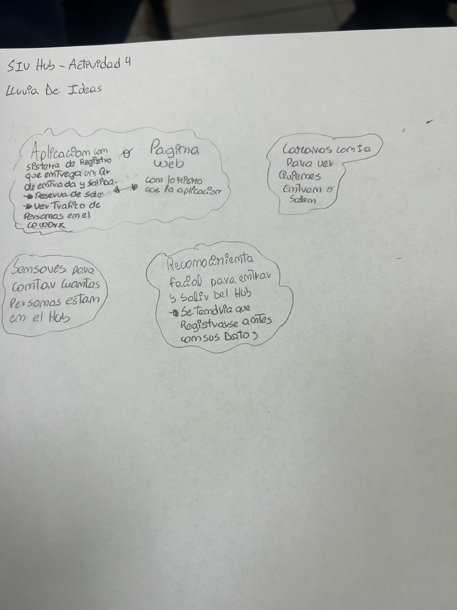
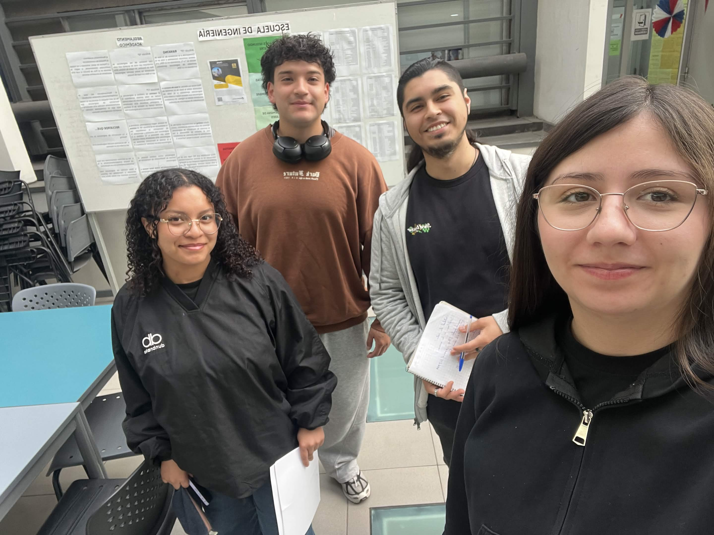

# S04 — Semana del 22 al 29 de septiembre de 2026

## 📅 Fecha
22 de septiembre de 2026

## 👥 Asistencia
Asistieron Amanda, Benjamín, Josué y Valentina. Gerzon no pudo asistir por
motivos de fuerza mayor y se le compartió lo trabajado en clase.

## 🏫 Trabajo realizado en clase

La clase estuvo dedicada a revisar qué soluciones ya existen para nuestro
problema, con qué atributos cumplen y dónde queda espacio para innovar.

### 📋 Actividad 2 — Estado del arte

**Problema:** cómo cuantificar y caracterizar a los usuarios del Hub
Providencia para la gestión de servicios y espacios.

| # | Nombre de la solución | ¿Cómo es? | ¿Quién la está usando? | ¿Cómo soluciona el problema? | Link |
|---|---|---|---|---|---|
| 1 | Sistema de registro | Sistema de registrar entrada con código QR | El Hub Providencia | Verificar quiénes entran al Hub | — |
| 2 | Reserva de salas | Plataforma donde se puede reservar una sala de reunión a cualquier hora | Work Café Santander | Método más sencillo para reservar y usar la sala, y saber si está ocupada o no | workcafe.cl |
| 3 | GeoVictoria | Sistema para marcar entrada y salida de los usuarios | Empresas | Marca entrada y salida registrando hora y ubicación en tiempo real | — |
| 4 | Cámaras con IA | Cámara que vigila con inteligencia artificial | Avigilon | Permite ver el comportamiento de los usuarios y reconocerlos | getavigilon.com |
| 5 | Reconocimiento facial | Base de datos biométricos | Universidad Mayor | Ingreso y salida por torniquete con reconocimiento facial | — |

### 📋 Actividad 3 — Matriz de atributos y análisis comparativo

**Matriz de atributos por solución existente**

| Atributo | Sol. 1 — Registro QR | Sol. 2 — Reserva de salas | Sol. 3 — GeoVictoria | Sol. 4 — Cámaras con IA | Sol. 5 — Reconocimiento facial |
|---|---|---|---|---|---|
| Atributo 1 | Accesible | Atractivo | Transportable | Autónomo | Sencillo |
| Atributo 2 | Sencillo | Accesible | Versátil | Personalizable | Durable |
| Atributo 3 | Liviano | Seguro | Seguro | Versátil | Adaptable |

**Análisis comparativo**

1. **¿Qué atributos NO están resueltos por ninguna de las soluciones existentes?**
   Portable, transparente y vanguardista.

2. **¿Qué atributo parecería ser el más relevante?**
   Accesible, seguido de seguro y sencillo.

3. **¿Dónde hay oportunidades para mejorar o innovar en nuestra propia propuesta?**
   En que la solución no es portable ni transparente: la mayoría de las
   soluciones existentes son accesibles, pero no le entregan información al
   usuario sin que esté físicamente en el lugar.

### 📋 Actividad 4 — Lluvia de ideas

- **Aplicación con sistema de registro** que entrega un QR de entrada y salida,
  con reserva de salas y visualización del tráfico de personas en el cowork.
- **Página web** con las mismas funciones que la aplicación.
- **Cámaras con IA** para ver quiénes entran y salen.
- **Sensores** para contar cuántas personas están en el Hub.
- **Reconocimiento facial** para entrar y salir del Hub, con registro previo
  de los datos de la persona.

### 💬 Preguntas y discusión
El análisis comparativo derivó en la definición del atributo que queremos que
tenga nuestra solución. El equipo concluyó que debe ser **accesible**, pero
sobre todo **portable**: hoy ninguna de las soluciones revisadas entrega
información al usuario si no está en el lugar. La idea es que una persona
pueda ver desde su casa si el Hub está lleno o si hay una sala disponible,
sin tener que ir hasta allá para enterarse.

### 🧠 Aprendizajes
- Ya existen soluciones para casi todas las piezas del problema (registro,
  reservas, control de entrada y salida), pero ninguna resuelve la
  transparencia hacia el usuario. Ahí está nuestro espacio para innovar.
- Las soluciones existentes que más se acercan a lo que necesitamos
  (GeoVictoria, cámaras con IA, reconocimiento facial) son productos pagados,
  lo que refuerza la decisión de construir algo propio y sin costo de
  licencias.
- Ponerle atributos a cada solución obliga a ser explícito con lo que
  queremos: "portable" pasó de ser una intuición a ser un requisito.

## 🏠 Trabajo realizado fuera de clases
- La visita al Hub programada para el 22 de septiembre no se pudo realizar
  porque el Hub tenía invitados ese día. Quedó reagendada para el 29 de
  septiembre.
- Se compartió con Gerzon el material trabajado en clase.

## 📌 Avances obtenidos
- Estado del arte con cinco soluciones existentes, identificando qué hacen,
  quién las usa y cómo resuelven el problema.
- Matriz de atributos de las cinco soluciones.
- Análisis comparativo con los atributos no cubiertos por el mercado.
- Definición del atributo diferenciador de nuestra propuesta: portable y
  transparente.
- Segunda lluvia de ideas, ahora orientada por los atributos.

## ⚠️ Problemas o dificultades
- No se pudo hacer la visita al Hub del 22 de septiembre porque el edificio
  tenía invitados. Se reagendó para el 29.
- Siguen sin respuesta las consultas a la contraparte, en particular qué se
  hace hoy con los datos del formulario de Google.

## 📌 Tareas pendientes

Arrastradas:
- [ ] Consultar qué se hace actualmente con los datos recolectados por el formulario de Google **(*)**
- [ ] Consultar por la situación actual de las cámaras del edificio
- [ ] Validar la estimación de personas diarias que usan el Hub
- [ ] Definir el listado simplificado de profesiones para el enrolamiento
- [ ] Evaluar alternativas para el registro de salida

Nuevas:
- [ ] Realizar la visita al Hub el 29 de septiembre, observando ingreso y salida de personas
- [ ] Decidir entre aplicación y página web como formato de la solución
- [ ] Traducir los atributos "portable" y "transparente" en funcionalidades concretas
- [ ] Completar los links faltantes del estado del arte (GeoVictoria, sistema de registro del Hub, reconocimiento facial U. Mayor)

## 📷 Evidencias

### Actividades de la clase
[📄 Actividades del 22 de septiembre (PDF)](evidencias/S04/actividades-22-sep.pdf)

**Estado del arte**

**Matriz de atributos**

**Análisis comparativo**

**Lluvia de ideas**

**Equipo trabajando en clase**

